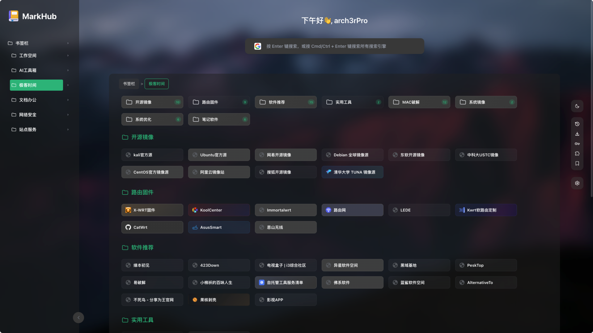
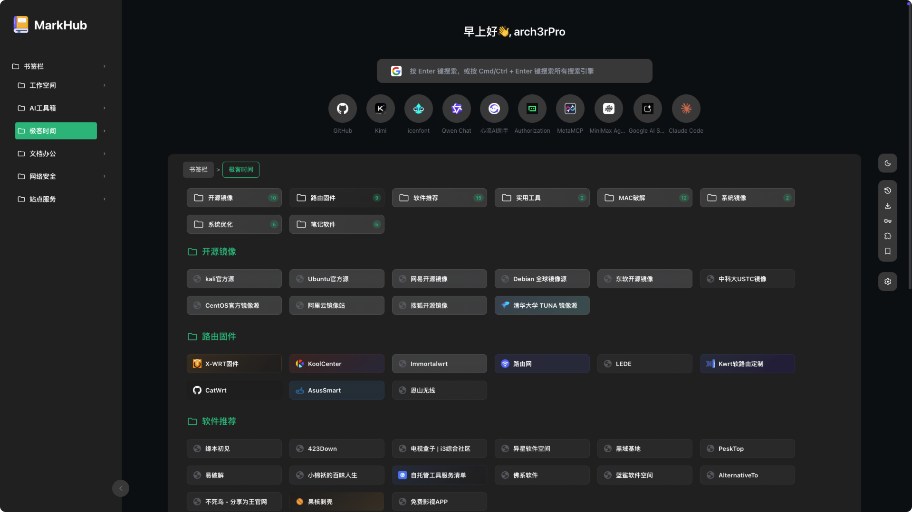
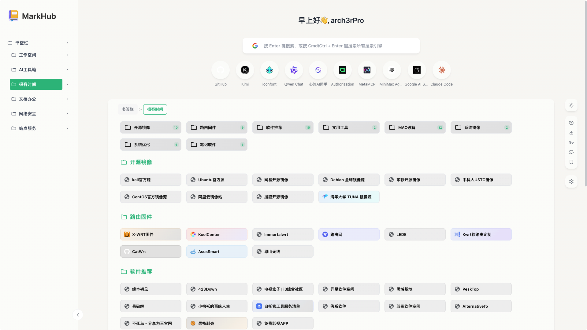
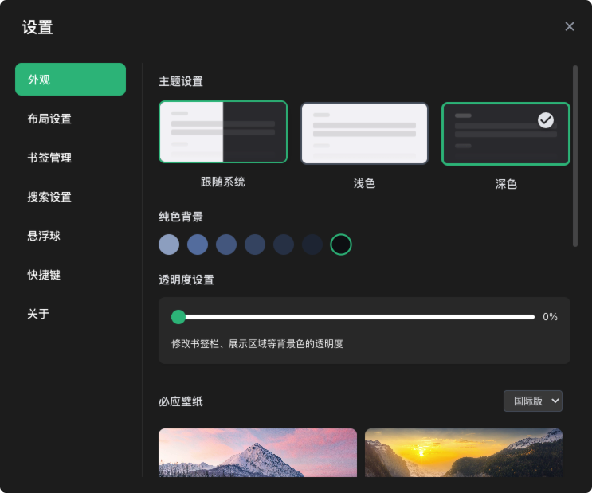

<div align="center">

## 🔖 MarkHub

**书签收藏爱好者的全能新标签页扩展**

[](https://chrome.google.com/webstore)
[](https://github.com)
[](LICENSE)

</div>

---

### ✨ 简介

MarkHub 是一款功能强大的浏览器新标签页扩展，专为书签管理和高效访问而设计。它将书签管理、快速搜索、个性化定制完美结合，让您的浏览体验更加高效、美观。



### 🎯 核心特性

- 📚 **智能书签管理** - 基于浏览器书签的可视化管理，支持文件夹固定、快速移动、数量统计
- 🔍 **多引擎搜索** - 集成 AI 搜索、通用搜索、社交媒体搜索，支持自定义搜索引擎
- 🎨 **高度定制化** - 深色/浅色主题、壁纸设置、透明度调节、布局自定义
- 🚀 **快速访问** - 侧边栏快捷键（Alt/Cmd + B）、悬浮球、网站推荐
- 🌐 **多语言支持** - 支持简体中文、繁体中文、英语、日语、韩语等多种语言


## 📦 安装方式

### Chrome / Edge / Arc / Dia

1. 暂未上架 [应用商店]
2. Chrome不支持使用未上架的应用，chrome用户请使用手动安装的方式
3. 其他浏览器可在Releases页面下载最新版的crx文件进行安装
4. 安装完成后，打开新标签页即可使用

### 手动安装（开发者模式）

1. 下载本项目源码
2. 打开浏览器扩展管理页面（`chrome://extensions/`）
3. 开启"开发者模式"
4. 点击"加载已解压的扩展程序"
5. 选择项目文件夹


## 🎨 功能特性

### 📖 书签管理

- ✅ 可视化书签展示，支持文件夹树状结构
- ✅ 书签宽度、高度、容器宽度自定义
- ✅ 书签卡片悬停显示完整信息
- ✅ 快速移动书签到其他文件夹
- ✅ 文件夹固定到主页（最多8个）
- ✅ 目录树图标显示控制
- ✅ 书签数量统计显示
- ✅ 选中状态记忆功能

### 🔍 搜索功能

#### 多引擎支持

**AI 搜索**
- ChatGPT、Claude、Kimi、豆包、Deepseek、Perplexity、Grok、Felo

**通用搜索**
- Google、Bing、百度、Yahoo、DuckDuckGo、Yandex、秘塔搜索、Semantic Scholar

**社交媒体**
- 小红书、知乎、豆瓣、哔哩哔哩、即刻、GitHub

#### 搜索特性
- ✅ 自定义默认搜索引擎
- ✅ 标签栏临时切换搜索引擎
- ✅ Cmd/Ctrl + Enter 全引擎搜索
- ✅ 自定义搜索引擎（支持添加任意搜索引擎）
- ✅ 搜索建议（历史记录、书签）
- ✅ 搜索结果打开方式自定义

### 🎨 外观定制

#### 主题设置
- 🌞 浅色模式
- 🌙 深色模式
- 🔄 跟随系统

#### 背景设置
- 🖼️ 预设壁纸库
- 🌏 必应每日壁纸（支持国内版/国际版切换）
- 📤 上传自定义壁纸（最大10MB）
- 🎨 纯色背景
- 🔲 透明度调节
- 🌫️ 壁纸模糊度设置

#### 布局设置
- ✅ 搜索框显示/隐藏
- ✅ 欢迎语显示/隐藏
- ✅ 页脚显示/隐藏
- ✅ 书签数量显示/隐藏
- ✅ 目录树图标显示/隐藏
- ✅ 快捷访问链接自定义（历史记录、下载、密码、扩展、书签管理）
- ✅ 书签容器宽度调节（20% - 95%）

### 🚀 快速访问

#### 侧边栏
- 按下 `Alt/Cmd + B` 打开快速侧边栏
- 在任意网页快速访问书签和搜索
- 支持自定义打开方式（新标签页/侧边栏内打开）

#### 悬浮球
- 点击打开快速搜索
- Alt + 点击打开侧边栏
- 可自定义启用/禁用

#### 网站推荐
- 显示最常访问的网站
- 支持右上角快速删除
- 可自定义启用/禁用

### ⚙️ 其他功能

- 🎯 链接打开方式自定义（主页/侧边栏）
- 🖱️ 滚轮切换固定文件夹
- ⌨️ 快捷键自定义
- 📊 年进度显示
- 🔗 右键菜单（新标签页/新窗口/无痕窗口打开）


## 🖼️ 功能截图

### 深色主题



### 浅色主题




### 设置界面




## 📝 版本更新

### v1.121（最新版本）

1. 侧边栏设置改为弹窗设置，优化展示效果
2. 外观设置修复深色模式下纯色背景颜色适配
3. 添加透明度设置，支持修改书签栏、展示区域等背景色的透明度
4. 修复必应壁纸未加载时异常报错，添加国际版必应壁纸并支持切换
5. 添加壁纸模糊设置，支持调整背景壁纸的模糊程度
6. 调整布局设置选项，添加书签管理快捷访问链接，添加目录树图标显示开关控制
7. 修复书签宽度设置大于75%不生效问题
8. 重新设计书签显示布局和逻辑，添加目录中书签数量统计
9. 添加书签快速移动修改所属目录功能
10. 优化书签卡片展示，添加浮窗显示完整名称和信息
11. 热门推荐添加右上角快速删除按钮和功能
12. 拆分左侧目录树的选中和折叠按钮，添加选中设置记忆


## 🤝 参与贡献

欢迎提交 Issue 和 Pull Request！

### 贡献指南

1. Fork 本仓库
2. 创建您的特性分支 (`git checkout -b feature/AmazingFeature`)
3. 提交您的更改 (`git commit -m 'Add some AmazingFeature'`)
4. 推送到分支 (`git push origin feature/AmazingFeature`)
5. 打开 Pull Request

### 开发环境设置

```bash
# 克隆仓库
git clone https://github.com/arch3rPro/MarkHub.git

# 进入项目目录
cd MarkHub

# 在 Chrome 中加载扩展
# 1. 打开 chrome://extensions/
# 2. 开启"开发者模式"
# 3. 点击"加载已解压的扩展程序"
# 4. 选择项目文件夹
```


## 💖 支持项目

如果您觉得 MarkHub 有用，欢迎通过以下方式支持我们：

- ⭐ 给项目点个 Star
- 🐛 报告 Bug 或提出新功能建议
- 📢 分享给更多人使用


## 📄 开源协议

本项目采用 [MIT License](LICENSE) 开源协议。


## 🙏 致谢

本项目由[TabMark-Bookmark-New-Tab](https://github.com/Alanrk/TabMark-Bookmark-New-Tab)进行二次开发，
特别感谢原作者的辛勤付出。


<div align="center">

**用 ❤️ 制作**

如果这个项目对您有帮助，请考虑给它一个 ⭐️

</div>